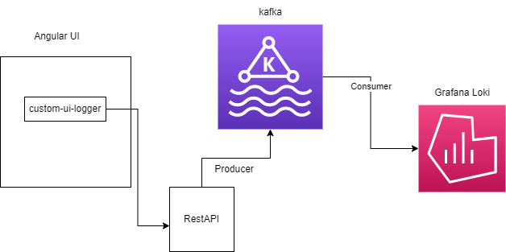

# custom-ui-logger

Run below command to setup 

npm install

npm run start

This code is part of project Observability (Front-end Code Observability), specially to use for fronend if you are not thinking to go for Observability product.  
Plugin will able to collect logs for console - error, warn, info and debug. 

you can also look my post about trying out Front-end Code Observability [here](https://medium.com/@avinashry.singh/front-end-code-observability-with-datadog-part-1-f256842ef539) or read more from internet.  

It is still in development but idea is to use as plugin with UI and collect metrics over rest api.

